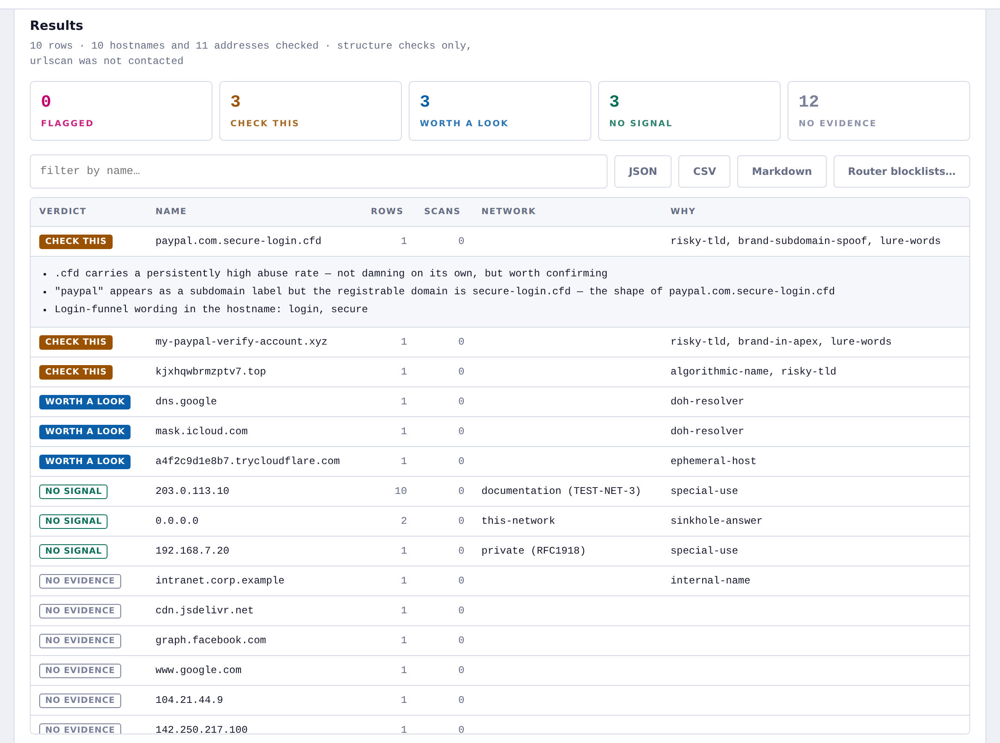

# urlscan-verify

Drop in a CSV. Get back a verdict on every domain and IP address in it.

Built for the case where you have a resolver log, a firewall export or a
spreadsheet of hostnames and the question is simply *is anything in here wrong?*
It answers that with [urlscan.io](https://urlscan.io)'s archive plus a set of
offline structure checks, and it can turn what it finds into blocklists your
router will actually eat.

Three ways to use it, all the same engine:

- **A local web app** — drag a CSV onto a page, watch it work, export the results.
- **A command line tool** — `urlscan-verify verify export.csv`, exits non-zero if
  anything is flagged, so it fits in a cron job.
- **An MCP server for Claude Code** — ask Claude "check this CSV" and it drives
  the verifier itself. Uses your existing Claude subscription; there is no
  Anthropic API key anywhere in this project.

No dependencies, no build step, no account except a free urlscan key.

---

## Install

Node 20.6 or newer, and nothing else.

```bash
git clone https://github.com/demonad112/bigdatacloud-mcp-server.git urlscan-verify
cd urlscan-verify
node bin/urlscan-verify.mjs --help
```

`npm install` is not required — the project has zero dependencies. Run
`npm link` if you want `urlscan-verify` on your `$PATH`.

## Your urlscan API key

Get one free at [urlscan.io → Settings & API](https://urlscan.io/user/apikey).
It is a UUID.

```bash
urlscan-verify config --key 00000000-0000-0000-0000-000000000000
```

That verifies the key against urlscan before storing it in
`~/.urlscan-verify/config.json`, mode `0600`. You can also set
`URLSCAN_API_KEY` in the environment, which takes precedence, or paste the key
into the web app's first card.

The key never leaves your machine, is never written into this repository, and is
never sent to the browser — the page only ever sees a masked form of it.

Everything except the archive lookups works with no key at all: run with
`--offline` for a free, instant structural pass.

## The web app

```bash
urlscan-verify serve
# → http://localhost:8787
```

Drop a CSV on the page. It shows you which columns it found and what it pulled
out of them, you press go, and results stream in as it works.

The server binds to loopback only and refuses cross-origin requests, because it
holds an API key and reads local files. **Your CSV is parsed in that local
process and is never uploaded anywhere.** The only thing that leaves your machine
is one urlscan query per unique hostname or address.



## The command line

```bash
# the basic case
urlscan-verify verify ~/Downloads/controld-export.csv

# free and instant — no key needed, no network
urlscan-verify verify hosts.csv --offline

# a large file: look at the 100 most frequent names first
urlscan-verify verify big-export.csv --limit 100

# write everything out
urlscan-verify verify export.csv --json report.json --csv verdicts.csv --md report.md

# and build router config from what was flagged
urlscan-verify verify export.csv --blocklist ./blocklist --block-severity critical,warning
```

Useful flags:

| Flag | What it does |
|---|---|
| `--offline` | Structure checks only. Never contacts urlscan. |
| `--limit N` | Only check the N most frequent hostnames. |
| `--deep` | When a suspicious name has no scans, widen the search to its apex. |
| `--allow a.com,b.com` | Domains you already trust; silences brand and lure signals for them. |
| `--no-cache` | Ignore the response cache and re-query everything. |
| `--verbose` | List every name, including the quiet ones. |

Exit status is `2` if anything came back flagged, `1` on error, `0` otherwise.

## Claude Code

`.mcp.json` in this repository registers the MCP server, so opening the project
in Claude Code is the whole setup. Approve the server when prompted, then:

> check the domains in ~/Downloads/controld-export.csv

Claude calls `verify_csv`, reads the verdicts, and tells you what matters. The
project also ships a skill that teaches it how to read the results — in
particular, never to report "no evidence" as "clean" — and a `/verify-csv`
command.

**This uses your Claude subscription.** The reasoning happens in the Claude
session you already have open. Nothing in this project talks to the Anthropic
API, and there is no place to put an Anthropic key.

To use it from Claude Desktop instead, add this to
`~/Library/Application Support/Claude/claude_desktop_config.json` — note the
absolute path, since Desktop does not launch from the project directory:

```json
{
  "mcpServers": {
    "urlscan-verify": {
      "command": "node",
      "args": ["/full/path/to/urlscan-verify/bin/urlscan-verify.mjs", "mcp"]
    }
  }
}
```

### Tools

| Tool | Purpose |
|---|---|
| `verify_csv` | Verify every domain and address in a CSV file |
| `verify_domains` | Verify an explicit list of hostnames |
| `verify_ips` | Verify an explicit list of addresses |
| `urlscan_search` | Raw archive search, for pivots the verifier does not cover |
| `urlscan_result` | One scan in detail, by UUID |
| `urlscan_scan` | Submit a URL for a fresh scan |
| `urlscan_quotas` | What is left of your urlscan budget |
| `export_blocklist` | Write the dnsmasq / nftables / pbr files |
| `verification_report` | The last run as a Markdown write-up |

---

## What it actually checks

### Any CSV, without configuration

Columns are detected from their contents, not just their headers, so Control D,
Pi-hole, AdGuard Home, pfSense and plain domain lists all work as-is. Quoted
fields, embedded newlines, tabs, semicolons, BOMs and headerless files are
handled. Multi-value answer cells (`1.1.1.1;1.0.0.1`) are split, and a CNAME
target sitting in an answer column is picked up as a hostname.

Columns named `sourceIp` and friends are verified but never paired with the
row's hostname — treating "client 1.2.3.4 asked about example.com" as a
resolution claim would manufacture a mismatch on every single row.

### Offline, free, instant

Run with `--offline` and you still get:

- **Impersonation** — a brand under someone else's registrable domain
  (`paypal.com.secure-login.cfd`), a brand *in* the domain
  (`my-paypal-verify-account.xyz`), and near-misses (`paypa1-secure.tk`).
  Calibrated so that `dns.google`, `googleusercontent.com` and `apple-cloudkit.com`
  stay silent — a verifier that flags your own CDN gets ignored, and then it
  catches nothing.
- **Homographs** — punycode labels and non-ASCII characters.
- **Machine-generated names** — entropy, vowel ratio, consonant runs and digit
  density, tuned to fire on `kjxhqwbrmzptv7` and not on `googleusercontent`.
- **Registry and hosting choices** — persistently abused TLDs, and free or
  tunnelled hosting (`trycloudflare.com`, `ngrok`, `duckdns`) that is trivially
  disposable and a common way around network policy.
- **Resolver bypass** — a device talking to a public DoH/DoT endpoint is routing
  around a filtering resolver. Includes iCloud Private Relay.
- **Address classification** — RFC 1918, CGNAT, link-local, documentation,
  benchmarking, ULA, Teredo, 6to4 and the rest, with IPv4-mapped IPv6 unwrapped
  so `::ffff:8.8.8.8` and `8.8.8.8` are one address.
- **Internal naming leaks** — `.lan`, `.corp`, `.internal` reaching a public
  resolver.

### With a key, against the archive

- Submitter threat tags on the name, or on a sibling under the same apex.
- Newly registered domains — under 30 days is a finding on its own.
- Popularity rank, so a young domain with no traffic history stands out.
- What urlscan has seen hosted on an address, and whether any of it was tagged.
- Densely shared hosting, so you know when an address says little about a site.

### Cross-checks the archive alone cannot do

When a row carries both a hostname and the address it answered:

- **`private-answer`** — a public name answered from a private address. DNS
  rebinding, a split-horizon override, or a bad local record. Suppressed for
  reserved internal names, where it is simply correct behaviour, and for
  `0.0.0.0`, which is what a filter returns when it blocks something.
- **`resolution-mismatch`** — urlscan has only ever seen this name on one
  network, and your file says it answered from a completely different one.
  Deliberately conservative: it needs several observations and no shared ASN
  before it will say anything, because a CDN legitimately answers from hundreds
  of addresses.

## Reading a verdict

| Verdict | Meaning |
|---|---|
| **Flagged** | Submitters tagged it hostile, or the signals are overwhelming. |
| **Check this** | Several signals line up. Confirm it is something you expect. |
| **Worth a look** | One mild signal. Usually benign. |
| **No signal** | Scanned, nothing stood out. Not an audit. |
| **No evidence** | Nobody has ever submitted this name to urlscan. |

**"No evidence" is not "clean."** urlscan only knows about URLs somebody
submitted to it. On a normal home-network export most rows land here, because
first-party telemetry endpoints have no public scan history — and that is not a
finding.

Two things this tool deliberately does not do:

**It does not use `verdicts.overall.malicious`.** That field is gated below a Pro
plan: searching on it returns 403, and reading it off a result document returns
`false` even for scans a submitter tagged `phishing`. A verifier built on it
would pronounce every domain clean. Submitter tags are what the archive actually
returns on a normal plan, so tags are what this uses.

**It does not treat its own verdicts as a threat feed.** They are urlscan
submitter tags plus structural analysis of the names themselves. Useful for
triage, not audited.

## Blocklists and OpenWrt

```bash
urlscan-verify verify export.csv --blocklist ./out --set-name urlscan_verify --pbr-interface wan
```

| File | For |
|---|---|
| `domains.txt` | Plain list, one name per line |
| `dnsmasq-block.conf` | `/etc/dnsmasq.d/` — blackholes the names |
| `hosts.txt` | `/etc/hosts` style, Pi-hole and friends |
| `dnsmasq-nftset.conf` | OpenWrt 22.03+ — feeds resolved addresses into an nftables set |
| `dnsmasq-ipset.conf` | OpenWrt 21.02 and older — the ipset equivalent |
| `nftables-addresses.nft` | The flagged addresses as an `nft` set |
| `pbr-policy.conf` | A policy stanza for the OpenWrt `pbr` package |

The nftset file is the interesting one. dnsmasq adds every address a listed name
resolves to into a named nftables set as it resolves it, which is how the
[`pbr` package](https://openwrt.org/docs/guide-user/network/routing/pbr) routes
by domain rather than by address — the same mechanism
[pta-block](https://github.com/LoV432/pta-block) uses to drive policy routing
from a domain list.

```sh
# on the router
cat >> /etc/nftables.d/10-urlscan-verify.nft <<'NFT'
set urlscan_verify  { type ipv4_addr; flags interval; }
set urlscan_verify6 { type ipv6_addr; flags interval; }
NFT
cp dnsmasq-nftset.conf /etc/dnsmasq.d/
/etc/init.d/dnsmasq restart
/etc/init.d/firewall restart
```

Read `domains.txt` before you deploy any of it. Every false positive is a name
your network can no longer reach.

## Rate limits, caching and long runs

urlscan's free tier is limited per minute, per hour and per day, independently
per action. Calls are serialised with a ~900 ms gap, retried once on a 429, and
cached on disk for 24 hours — so re-running the same file costs nothing, and a
run stopped by a rate limit picks up where it left off.

A 900-name export takes about fifteen minutes. Start with `--limit 100` to see
the shape of a file before committing to the whole thing.

```bash
urlscan-verify quotas         # what is left
urlscan-verify config --clear-cache
```

## Why it runs locally

Everything here is local on purpose. The alternative — deploying this behind a
URL — means your resolver export is uploaded to a server, the key lives in a
platform's environment, and a fifteen-minute verification has to survive a
serverless function timeout. None of that is a trade worth making for a tool
whose entire input is a log of what your devices talk to.

## Development

```bash
npm test        # 58 tests, no network, no dependencies
```

The suite covers address and hostname parsing, CSV detection against real export
shapes, heuristic calibration (including that ordinary first-party names stay
silent), verdict logic against a stubbed urlscan, client rate-limit and cache
behaviour, and every blocklist output format.

| File | |
|---|---|
| `src/net.mjs` | Addresses, CIDRs, hostnames, apex extraction |
| `src/csv.mjs` | Parsing, column detection, extraction |
| `src/heuristics.mjs` | Offline signals |
| `src/urlscan.mjs` | API client — pacing, retries, caching |
| `src/verify.mjs` | The engine and the scoring |
| `src/report.mjs` | Terminal, Markdown and CSV output |
| `src/blocklist.mjs` | Router export formats |
| `src/server.mjs` | The local web app |
| `src/mcp.mjs` | The MCP server |

## Licence

MIT.
